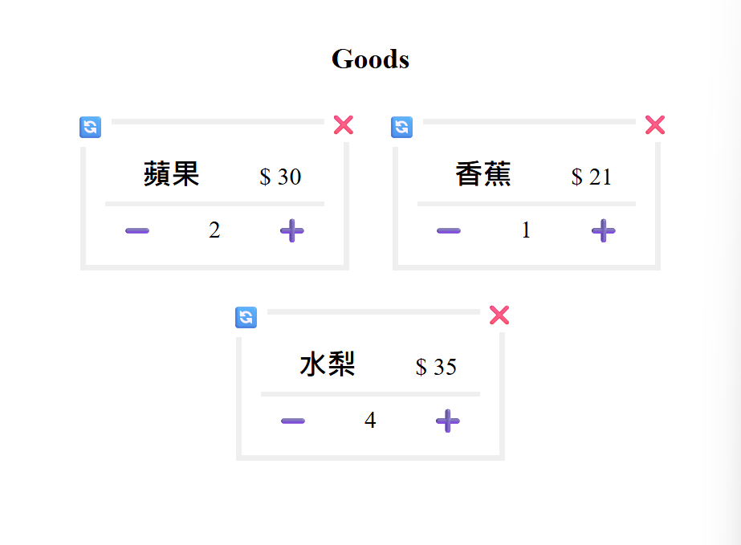

# 價格計數器 | JavaScript DOM 實作練習
使用原生 JavaScript 撰寫的互動式商品價格計數器，具備新增商品及其價格、編輯個商品數量、刪除商品等功能

## 練習目的
在掌握 JavaScript DOM 操作與事件處理的基礎後，希望透過此小專案練習表單驗證、事件處理等操作，並進一步強化以下能力： 
- 局部渲染( DOM 僅差異處更動)
- 動態建立與修改 DOM 元素 
- 事件處理
- 函式拆分思維

## 功能清單與技術使用
| 功能 | 簡述 | 實作 | 主要使用API/方法 |
| :---: | :---: | :--- | :--- |
| 表單驗證 | 若使用者未填寫事件名稱或狀態(空白視為未填寫)，<br>則禁止送出並顯示錯誤訊息 | 1.表單添加事件監聽器阻止預設送出行為<br>2.若表單元素值為空，則抓取指定元素寫入提示訊息 | e.preventDefault()<br>Element.value<br>String.trim() |
| 建立計數器 | 若表單驗證通過則添加此品項計數器 | 複製已建構好的HTML模板填入表單值 | `<template>` 元素<br>Node.cloneNode<br> |
| 商品數量調整 | 若使用者點擊➕、➖或🔄️按鈕可調整商品數量(分別為: 加1、減1、重置) | 計數器群組區添加事件監聽器，利用事件代理搭配自訂類別判斷調整方式，最後重新渲染更動元素 | e.target<br>Element.closest()<br>Element.classList.contains()<br>Array.findIndex() |
| 品項刪除 | 若使用者點擊❌按鈕可移除品項 | 若使用者點擊 :x: 按鈕則刪除此則訊息 | 留言展示區添加事件監聽器捕捉點擊行為，利用事件代理將留言刪除 | e.target<br>Element.closest()<br>Element.classList.contains()<br>Element.remove() |
| 資訊統整清單 | 網頁最下方會呈現統整紀錄，包含: 各項商品名稱與總金額、金額總和 | 利用類別抓取各商品資訊、自訂屬性(data-id)定位變動元素，使其能夠動態呈現 | 自訂陣列變數 item (狀態管理)<br>其餘同商品數量調整 | 


## 練習成果
以下為清單展示的畫面截圖

### 初始畫面
>

### 表單驗證: 必填項目空白提示
>

### 品項數量調整
>
>
### 統整清單
>

## 學習心得
[點擊查看](學習心得.md)

## 檔案結構
```
計數器/
├── index.html  #主頁面
├── style.css  #樣式設定
├── javascript.js  #事件處理
├── img/  #成果圖片
├── 學習心得.md
└── README.md  #說明文件
```