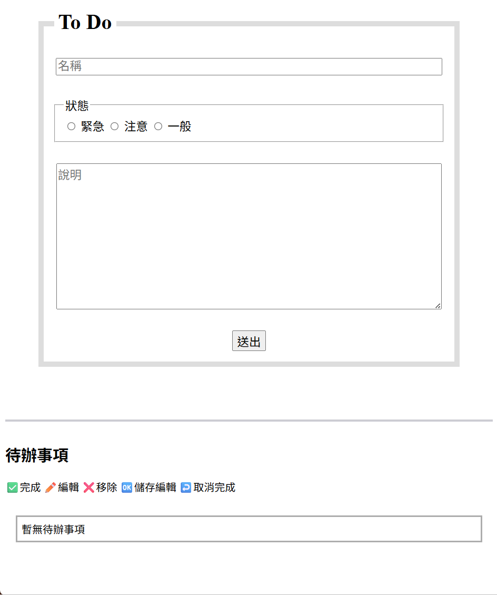
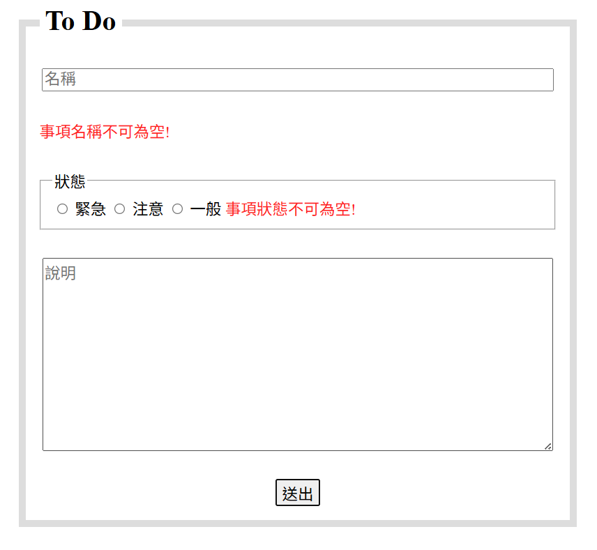
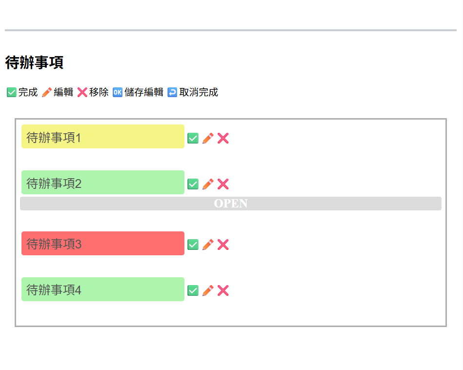
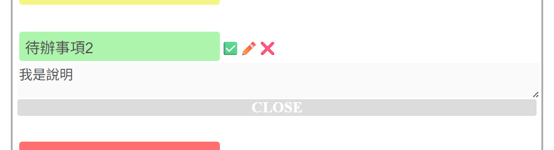

# 待辦清單 | JavaScript DOM 實作練習
使用原生 JavaScript 撰寫的互動式待辦清單，具備新增/編輯/完成/刪除事項、展開/收合說明等互動功能

## 練習目的
在掌握 JavaScript DOM 操作與事件處理的基礎後，希望透過此代辦清單小專案進一步強化以下能力： 
- 表單資料擷取與基本驗證 
- 動態建立與修改 DOM 元素 
- 事件處理
- 模組化思維

## 功能清單與技術使用
| 功能 | 簡述 | 實作 | 主要使用API/方法 |
| :---: | :---: | :--- | :--- |
| 表單驗證 | 若使用者未填寫事件名稱或狀態(空白視為未填寫)，<br>則禁止送出並顯示錯誤訊息 | 1.表單添加事件監聽器阻止預設送出行為<br>2.取得表單元素值檢查，若為空則抓取指定元素寫入提示訊息 | Element.addEventListener()<br>e.preventDefault()<br>Element.value<br>String.trim() |
| 事件清單展示 | 顯示事件內容(名稱、狀態與說明)| 1.抓取表單輸入值<br>2.將表單結果加入清單展示區塊<br>3.若有說明則建立收合區塊 | document.createElement()<br>document.createDocumentFragment()<br> Element.value<br>Node.appendChild()<br>Element.classList.add()<br>formObject.reset() |
| 事件清單編輯:完成及取消 | 若使用者點擊  ✅按鈕則將此事項添加完成標記 點擊 :leftwards_arrow_with_hook: 可取消完成操作 | 清單展示區添加事件監聽器捕捉點擊行為，利用事件代理將事項添加/刪除類別 | Element.addEventListener()<br>e.target<br>Element.closest()<br>Element.classList.contains()<br>Element.classList.replace() |
| 事件清單編輯:編輯及儲存 | 若使用者點擊 ✏️ 按鈕 可更改名稱與說明<br>點擊 :ok: 保存編輯 | 清單展示區添加事件監聽器捕捉點擊行為，利用事件代理與input標籤disabled屬性切換狀態 | Element.addEventListener()<br>e.target<br>Element.closest()<br>document.querySelectorAll()<br>array.forEach()<br>Element.classList.contains()<br>Element.classList.replace() |
| 事件清單編輯:移除事項 | 若使用者點擊 :x: 按鈕則刪除此則訊息 | 清單展示展示區添加事件監聽器捕捉點擊行為，利用事件代理將事項刪除 | Element.addEventListener()<br>e.target<br>Element.closest()<br>Element.classList.contains()<br>Element.remove() |


## 練習成果
以下為清單展示的畫面截圖

### 初始畫面
>

### 表單驗證: 必填項目空白提示
>

### 待辦清單展示
>
>
### 說明展開
>

## 學習心得
[點擊查看](學習心得.md)

## 檔案結構
```
待辦清單/
├── index.html  #主頁面
├── style.css  #樣式設定
├── javascript.js  #事件處理
├── img/  #成果圖片
├── 學習心得.md
└── README.md  #說明文件
```