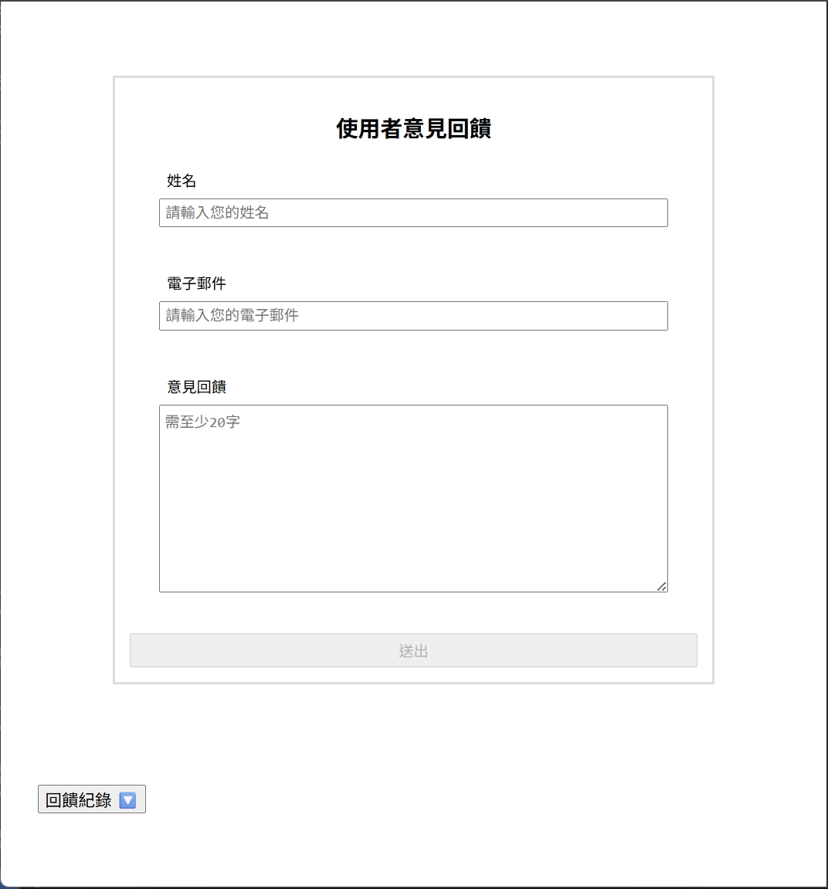
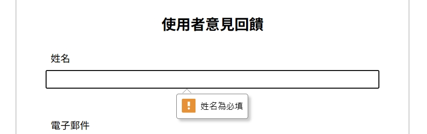
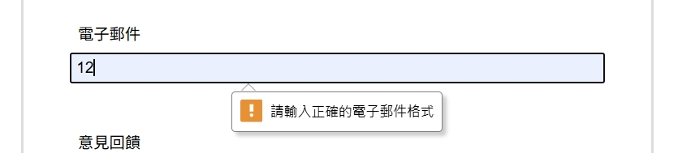
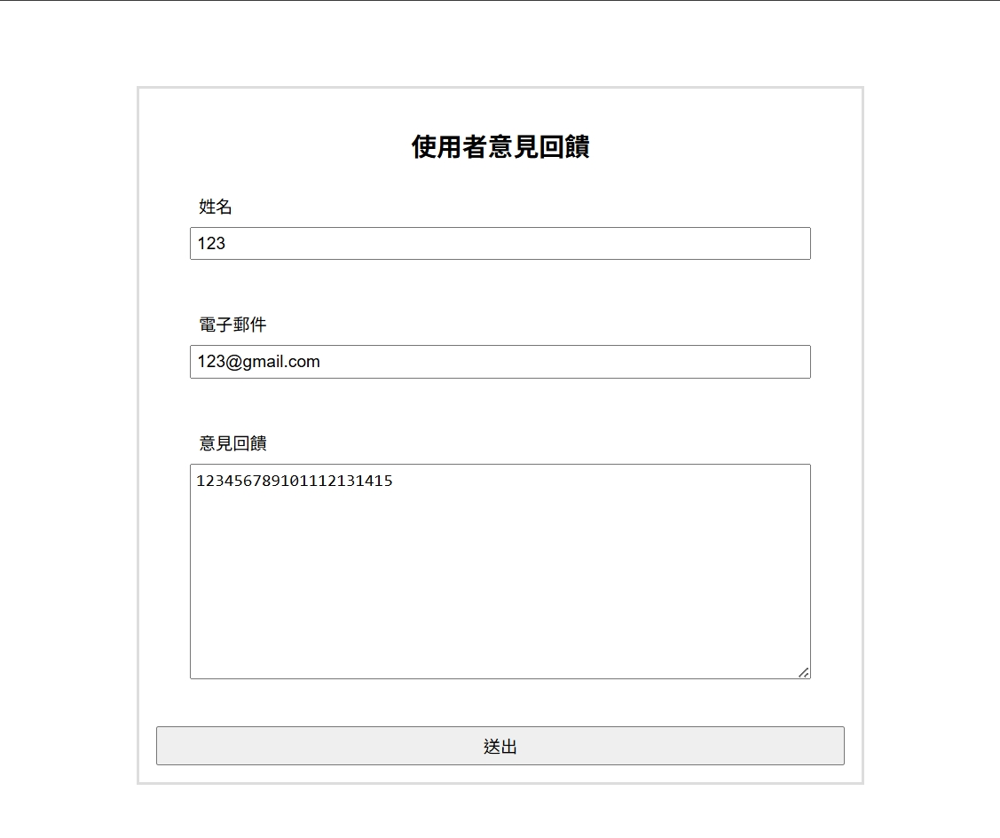
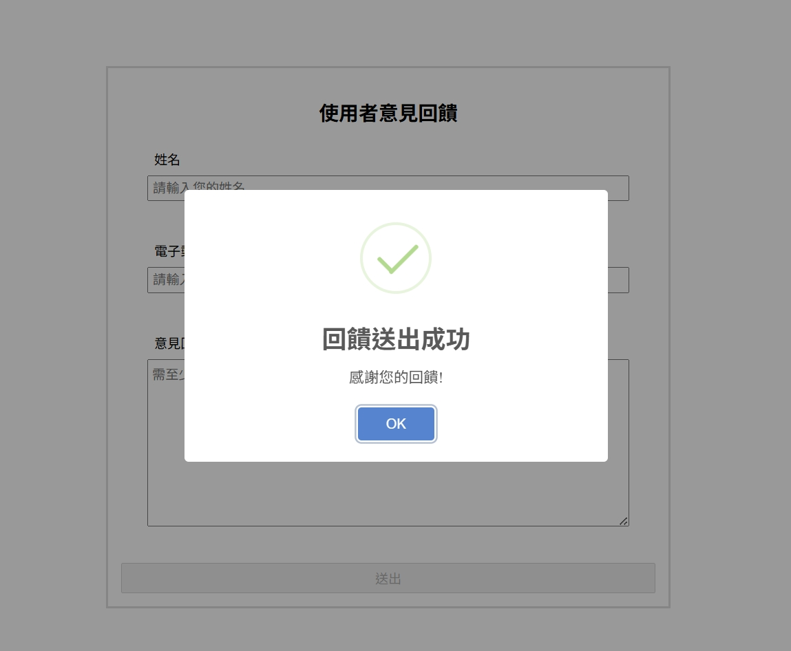
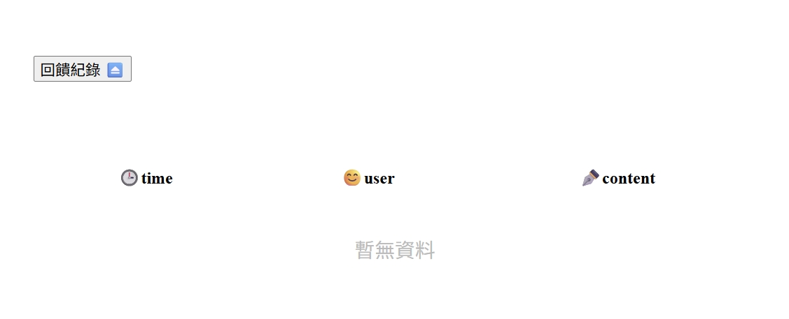
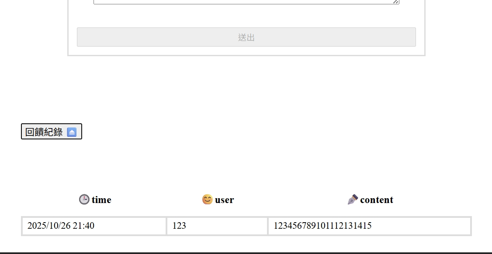

# 意見回饋表 | JavaScript DOM 實作練習
使用原生 JavaScript 撰寫的意見回饋表填寫頁面，具備送出回饋、查看回饋紀錄等功能

## 練習目的
在掌握 JavaScript 的非同步事件處理與 localStorage/sessionStorage 物件後，希望透過此小專案進一步強化以下能力：
- 原生 JS 表單驗證
- 非同步更新資料
- 瀏覽器儲存資料


## 功能清單與技術使用
| 功能 | 簡述 | 實作 | 主要使用API/方法 |
| :---: | :---: | :--- | :--- |
| 表單驗證 | 若使用者未填寫名稱、電子郵件或回饋內容，則無法送出表單<br>若名稱為空白、電子郵件為空白或格式不符、回饋內容少於20字(空白不視為一個字元)，則顯示提示訊息 | 1.輸入欄位添加屬性與事件監聽器檢查輸入，並設定表單提交按鈕僅在通過驗證後才可點擊<br>2.若表單輸入不符要求則顯示自訂輸入提示 | Element.checkValidity()<br>Element.setCustomValidity()<br>Element.reportValidity()<br>Element.removeAttribute() |
| 送出回饋 | 若表單驗證通過則將內容傳送至後端(使用公開API: 'https://jsonplaceholder.typicode.com/posts') | 1.表單添加事件監聽器阻止預設送出<br>2.利用 FormData 物件收集表單值，並使用 fetch() 向模擬後端傳送資訊<br>3.處理例外情況避免影響使用者體驗 | new FormData()<br>fetch()<br>try{}catch(){} |
| 回饋記錄 | 使用者可點擊按鈕查看回饋紀錄 | 1.表單提交時會同步將資料儲存在localStorage<br>2.點擊按鈕觸發事件，同步 HTML 與 localStorage 的紀錄 | e.target<br>Element.closest()<br>Element.classList.contains()<br>Array.findIndex() |


## 練習成果
以下為清單展示的畫面截圖

### 初始畫面
>

### 表單驗證: 輸入項目提示
>
>
>

### 回饋填寫與送出
>
>
### 查看回饋記錄
>
>

## 學習心得
[點擊查看](學習心得.md)

## 檔案結構
```
意見回饋表/
├── index.html  #主頁面
├── style.css  #樣式設定
├── javascript.js  #事件處理
├── img/  #成果圖片
├── 學習心得.md
├── 非同步操作學習筆記.md
└── README.md  #說明文件
```