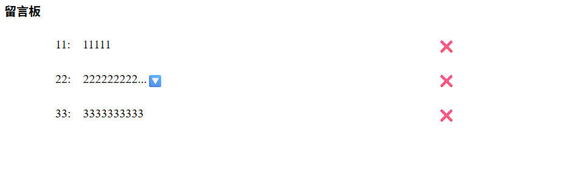

# 簡易留言板 | JavaScript DOM 實作練習
使用原生 JavaScript 撰寫的互動式留言板，具備留言新增、刪除及(過長留言)展開/收合功能

## 練習目的
在掌握 JavaScript DOM 操作與事件處理的基礎後，希望透過此留言板小專案進一步強化以下能力： 
- 表單資料擷取與基本驗證 
- 動態建立與修改 DOM 元素 
- 事件處理
- 事件代理
- 程式結構化練習

## 功能清單與技術使用
| 功能 | 簡述 | 實作 | 主要使用API/方法 |
| :---: | :---: | :--- | :--- |
| 表單驗證 | 若使用者未填寫姓名或留言內容(空白視為未填寫)，<br>則禁止送出並顯示錯誤訊息 | 1.表單添加事件監聽器阻止預設送出行為<br>2.若表單元素值為空，則抓取指定元素寫入提示訊息 | e.preventDefault()<br>Element.value<br>String.trim() |
| 留言展示 | 顯示使用者留言，若留言內容超過二十字則加上收合功能 | 1.抓取表單輸入值，若留言內容字數超過指定值則做收合處理<br>2.將表單結果加入留言展示區塊 | document.createElement()<br>document.createDocumentFragment()<br>Node.appendChild()<br>Element.classList.toggle() |
| 留言刪除 | 若使用者點擊 :x: 按鈕則刪除此則訊息 | 留言展示區添加事件監聽器捕捉點擊行為，利用事件代理將留言刪除 | e.target<br>Element.closest()<br>Element.classList.contains()<br>Element.remove() |


## 練習成果
以下為留言板的畫面截圖

### 初始畫面
>

### 表單驗證
#### 姓名空白提示
>
#### 留言內容空白提示
>

### 留言展示
>
#### 長留言展開
>

## 學習心得
[點擊查看](學習心得.md)

## 檔案結構
```
簡易留言板/
├── index.html #含HTML、CSS與JS
├── img/ #成果圖片
├── 學習心得.md
└── README.md
```